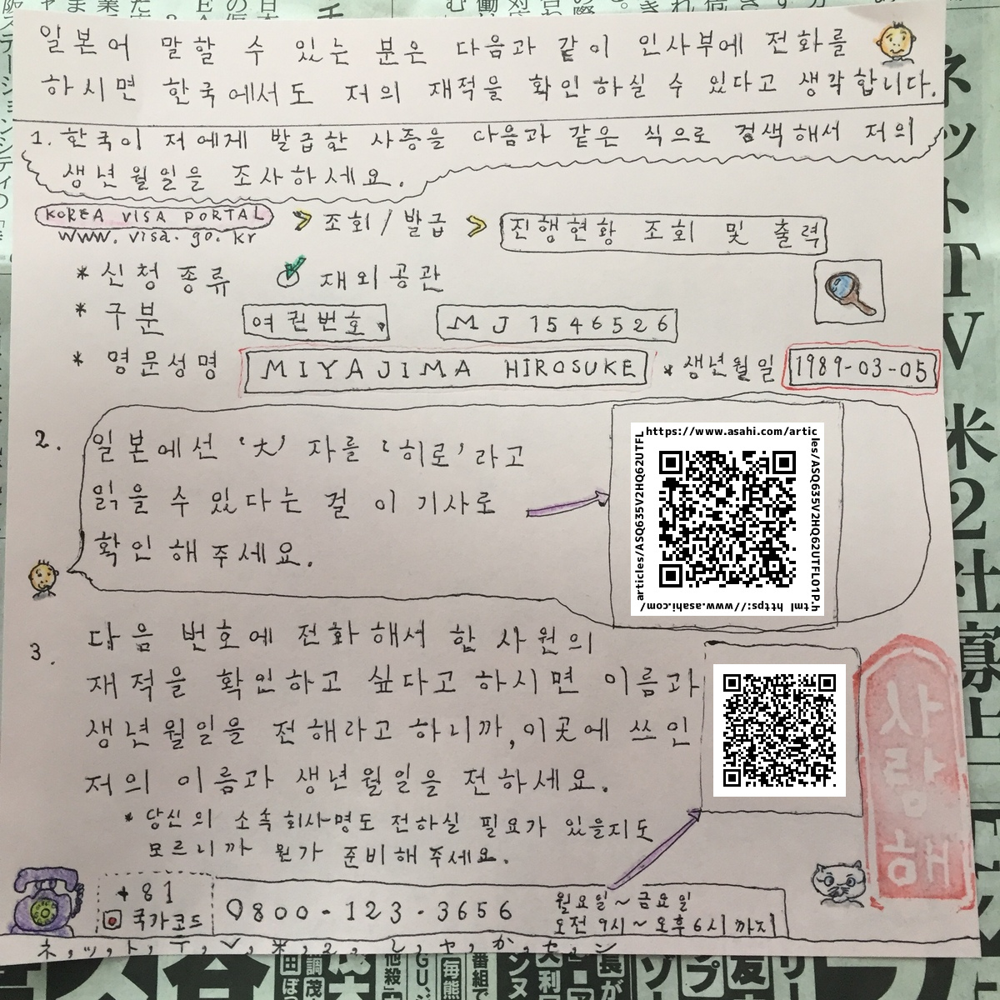
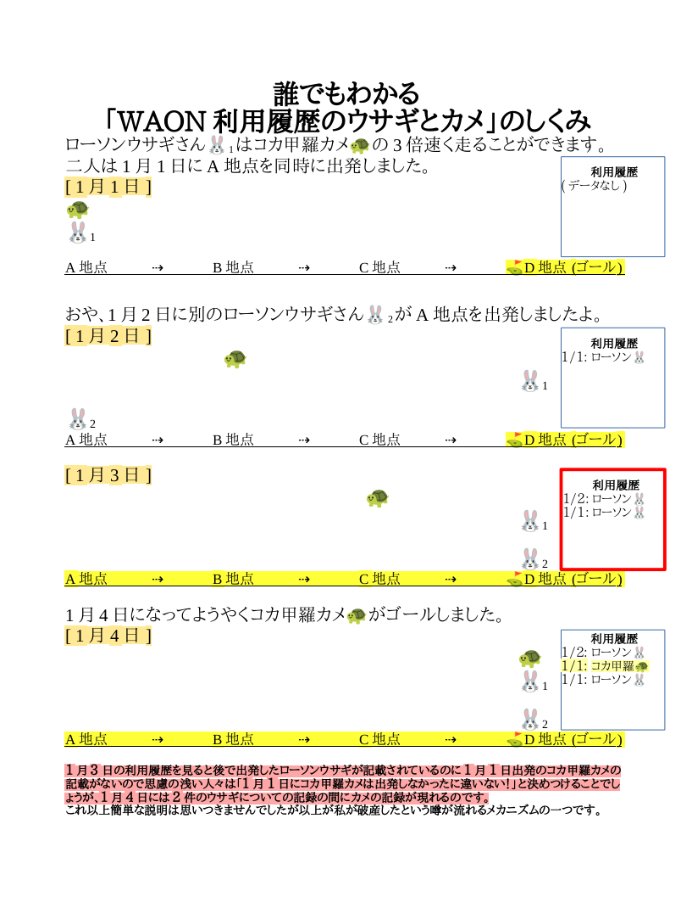
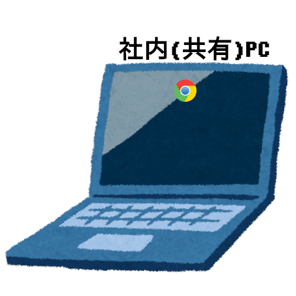

# fragments
Some excerpts from my website

> **NFTC** stands for **N**on **F**ixed **T**erm **C**ontract.  
> 
> -- a HRBP at my site 

### June 15, 2024 
- Dear Amazonians, this morning I wrote a comment to this article on A to Z News (https://news.a2z.com):
  - *What we can learn from CTO Dr. Werner Vogels' simple approach to AI*
  - https://news.a2z.com/contents/38398012
- As you see my comment is like this:
  - I see a comment, which is older than the article that holds it, asking something so now I ask you “Why do you keep manipulating publication date of articles? Why don’t you use these AI tools if you cannot manage to write yourself?” Anyway, you can confirm that this is mine by comparing @hirosuk with what you’ll get by clicking my photo. And, @hirosuk is for Hirosuke Miyajima, an associate at KIX3: https://fclm-portal.amazon.com/employee/activityDetails/ppa?employeeId=hirosuk&warehouseId=KIX3

### June 14, 2024 
- Dear Amazonians, this morning I wrote a comment to this article on A to Z News (https://news.a2z.com):
  - *4 of our VPs share their best leadership tips and career lessons*
  - https://news.a2z.com/contents/38379139
- As you see my comment is like this:
  - You may noticed that this has a comment that is slightly older than the article itself. Well it’s about 5 hours older. Hirosuke (大介) Miyajima, an associate at KIX3 PS: My alias is @hirosuk and you can confirm that this comment was made by me by comparing @hirosuk with what you’ll get by clicking my face shown on the left. 4랑해요. / コメント欄に記事そのものより数時間古いコメントがあります。つまり投稿時刻が後から変更されたということです。

### June 9, 2024 
- Dear Amazonians, this morning I wrote three comments to this article on A to Z News (https://news.a2z.com):
  - *Japan Culture Fest は明日開催!参加してAmazonカルチャーを深く知ろう | The Japan Culture Fest is tomorrow! Join us and deepen your knowledge about Amazon's culture*
  - https://news.a2z.com/contents/38305412
- As you see my comments are like these:
  - 検定にちなんで雑学を披露致します。
その1. このコメント欄に @hirosuk のように「@+ログインID」を書くとそのユーザーのプロフィールへのリンクが現れます。 @hirosuk をクリックすると表示されるページはこのコメントの横にある私の顔写真をクリックすると表示されるページとURLが同一ですから,このコメントの作成者である私のログインIDがhirosukであることが確認できます。
  - その2. 別所に書いたようにアマゾンジャパンに属するL1アソシエイトをPhoneToolにて検索することは不可能ですが,下記のようにログインIDを含むURLにアクセスするとFCLMを含む代替の選択肢が提案されます。 https://phonetool.amazon.com/users/hirosuk そこでFCLMにてこのログインIDを検索するとこれが「KIX3のHirosuke Miyajima」であることが分かります。 https://fclm-portal.amazon.com/employee/activityDetails/ppa?employeeId=hirosuk&warehouseId=KIX3
  - その3. 下段にコメントを書かれている方のように長いミドルネームを登録することでコメント横の苗字を非表示にすることが出来ます。但しA to Z Newsの仕様上苗字の変更は出来ませんので(下記スクリーンショットを参照)この方の顔写真をクリックするとこの方の苗字が「Suzuki」であることが分かります。 https://drive.corp.amazon.com/documents/hirosuk@/atoz/jun09.PNG 下記アドレスにあるOWAの左上「メールとユーザーの検索」欄に「Hirosuke」と入力することによっても私の情報がご覧になれます。こんな問題は出題されないでしょうが。 https://ballard.amazon.com/owa/

### June 8, 2024 
- Dear Amazonians, this morning I wrote two comments to this article on A to Z News (https://news.a2z.com):
  - *Captain Picard, an email storm, dancing boxes: All-Amazon Meeting archive dive*
  - https://news.a2z.com/contents/38347565
- As you see my comments are like these:
  - I’d like to remind you that, this article was seen a few days ago on A to Z News. Please just scroll down the comment section; You shall see some comments that were made a day ago & get that its ‘Published 7 hours ago’ or something like isn’t correct. / この記事のコメント欄を下の方にスクロールすると記事の投稿日時より古い、1日前のコメントが出てきます。私が本記事に「いいね」したのは1日以上前のことです。(つまり投稿日時が後で変更されたということです) @hirosuk Hirosuke (大介) Miyajima https://fclm-portal.amazon.com/employee/activityDetails/ppa?employeeId=hirosuk&warehouseId=KIX3
  - PS: ちなみに現在アマゾンジャパン所属のL1アソシエイトの情報はPhoneToolでは検索出来ないようになっています。詳細は下記に書いてあります。Hirosuke (大介) Miyajima, a L1 associate at KIX3
https://w.amazon.com/bin/view/Users/hirosuk/

### June 5, 2024 
- Dear Amazonians, this morning I wrote a comment to this article on A to Z News (https://news.a2z.com):
  - *What is OP1? Here's what it's for and why it matters.*
  - https://news.a2z.com/contents/36273323
- As you see my comment is like this:
  - This article has some comments made about a YEAR ago so it’s apparent that it was actually published before that, not ‘7 hours ago’ or something like that it tells you now. I may ‘liked’ it in 2023 but not a several hours ago when I was asleep. / よく見るとこの記事には2023年に書かれたコメントがありますね。記載されている投稿日時は正しくないということです。私がこれに「いいね」したのは去年のことです。@hirosuk Hirosuke (大介) Miyajima, an associate at KIX3 https://fclm-portal.amazon.com/employee/activityDetails/ppa?employeeId=hirosuk&warehouseId=KIX3

### June 2, 2024 
- Dear Amazonians, this morning I wrote a comment to this article on A to Z News (https://news.a2z.com):
  - *6月7日開催のJapan Culture Festに参加して,ファイナリストを応援しよう! | Join the Japan Culture Fest on June 7 and cheer on our finalists!*
  - https://news.a2z.com/contents/38201705
- As you see my comment is like this:
  - KIX3からの候補者がなく残念です。 @hirosuk KIX3 宮島大介 https://fclm-portal.amazon.com/employee/activityDetails/ppa?employeeId=hirosuk&warehouseId=KIX3

### June 1, 2024 
- Dear Amazonians, this morning I wrote a comment to this article on A to Z News (https://news.a2z.com):
  - *4 ways to prepare for an internal interview and make a great impression* 
  - https://news.a2z.com/contents/38285425
- As you see my comment is like this:
  - This article has 4 comments that are older than 2 days so it is clear that it was actually published more than a day ago. Anyway I was astonished even today on seeing that my ‘like’ there even though I was asleep 8 hours ago which they state is the time they published it at. @hirosuk Hirosuke (大介) Miyajima, an associate at KIX3 https://fclm-portal.amazon.com/employee/activityDetails/ppa?employeeId=hirosuk&warehouseId=KIX3

### May 25, 2024 
- Dear Amazonians, this morning I wrote a comment to this article on A to Z News (https://news.a2z.com):
  - *Don't view it alone. Find a watch party here, or use our guide to host your own.*
  - https://news.a2z.com/contents/38157081
- As you see my comment is like this:
  - Of course I won’t see it alone; Well I’ll watch it on Japan Internal Communications channel of broadcast.amazon.com with some nifty Japanese captions. BTW I feel it’s possible that the publication date of this article has got modified even though I cannot tell since there hadn’t been comments before mine. 감사, @hirosuk Hirosuke (大介) Miyajima, an associate at KIX3 https://fclm-portal.amazon.com/employee/activityDetails/ppa?employeeId=hirosuk&warehouseId=KIX3

### May 18, 2024 
- Dear Amazonians, this morning I wrote a comment to this article on A to Z News (https://news.a2z.com):
  - *Interested in a new internal role? Learn more with an informational chat.* 
  - https://news.a2z.com/contents/38231438
- As you see my comment is like this:
  - The oldest comment for this article is a several hours older than the article itself. It does mean that they have modified the publication date again for this. I think that it’s their unproductiveness that make them keep making old stuffs look new in this manner. @hirosuk Hirosuke (大介) Miyajima, an associate at KIX3 https://fclm-portal.amazon.com/employee/activityDetails/ppa?employeeId=hirosuk&warehouseId=KIX3

### May 16, 2024 
- Dear Amazonians, this morning I wrote a comment to this article on A to Z News (https://news.a2z.com):
  - *How we AI: 5 Amazonians share how they use our new tools to be more effective*
  - https://news.a2z.com/contents/38226287
- As you see my comment is like this:
  - I see this has a comment made a day ago even though it states that it was published 8 hours ago. So it’s clear it’s older than it states. I clearly remember that I’ve liked this article, a few days ago, perhaps, but since the publication date is inaccurate someone may think that I liked it as soon as it was published when it was midnight here in Japan. Hirosuke (大介) Miyajima, an associate at KIX3 https://fclm-portal.amazon.com/employee/activityDetails/ppa?employeeId=hirosuk&warehouseId=KIX3

### May 11, 2024 
- Dear Amazonians, this morning I wrote a comment to this article on A to Z News (https://news.a2z.com):
  - *Want to know where our largest corporate office is? Take a tour.*
  - https://news.a2z.com/contents/38017899
- As you see my comment is like this:
  - Just by scrolling down the comment section of this you can get that the oldest comment was made on APRIL. So it’s clear that the publication date of this article has got modified at least once. Anyway I was astonished on seeing my ‘like’ there, even though I was asleep 7 hours ago which they state is the time it was published at. @hirosuk Hirosuke (大介) Miyajima, an associate at KIX3 https://fclm-portal.amazon.com/employee/activityDetails/ppa?employeeId=hirosuk&warehouseId=KIX3

### May 9, 2024 
- Dear Amazonians, this morning I wrote a comment to this article on A to Z News (https://news.a2z.com):
  - *Considering an internal transfer? Use this checklist to help land a new role.*
  - https://news.a2z.com/contents/38183425
- As you see my comment is like this (I also wrote a comment with some examples that contain LoginId of my co-workers but as they're sensitive information I do not show them here):
  - Please just look at the oldest comment for this (it’s made a day ago) and you’ll get that they’ve modified the publication date again for it. BTW did you know that none of Tier-1 here in Japan has PhoneTool? We have to promote to Tier-2 to have a blue badge that is necessary to apply for internal transfer 😥
https://phonetool.amazon.com/users/hirosuk
https://fclm-portal.amazon.com/employee/activityDetails/ppa?employeeId=hirosuk&warehouseId=KIX3

### May 5, 2024 
- Dear Amazonians, this morning I wrote a comment to this article on A to Z News (https://news.a2z.com):
  - *It's time to give back. Sign up to volunteer today.*
  - https://news.a2z.com/contents/38085814
- As you see my comment is like this:
  - This one also have some comments older than itself. Well just by scrolling down you’ll see some made five days ago so it’s clear they’ve modified the date again for some purpose. @hirosuk Hirosuke (大介) Miyajima, an associate at KIX3 | https://fclm-portal.amazon.com/employee/activityDetails/ppa?employeeId=hirosuk&warehouseId=KIX3

### May 2, 2024 
- **UPDATE:** At lunchtime I wrote another comment to this:
  - *Amazon wallpaper for May 2024: Success and Scale Bring Broad Responsibility* 
  - https://news.a2z.com/contents/38125681
- As you see my comment is like this:
  - Just by looking at the comment section you’ll get that it has a comment made a day ago so it’s clear that they have modified the publication date again for this article. Anyway I was astonished on seeing that my ‘like’ was somehow there even though about 4 hours ago which they state is the time it was first published, I was at the oper. area. Thanks, Hirosuke (大介) Miyajima, an associate at KIX3 | https://fclm-portal.amazon.com/employee/activityDetails/ppa?employeeId=hirosuk&warehouseId=KIX3
- Dear Amazonians, this morning I wrote a comment to this article on A to Z News (https://news.a2z.com):
  - *Q1 2024 financial results webcast*
  - https://news.a2z.com/contents/38047931
- As you see my comment is like this:
  - Just by looking at the comment section you’ll get that it has a comment made about 23 hours ago so it’s clear that they have modified the publication date again for this article. Anyway I was astonished on seeing that my ‘like’ was somehow there even though about 40 minutes ago which they state is the time it was first published, I was at home. Thanks, Hirosuke (大介) Miyajima, an associate at KIX3 | https://fclm-portal.amazon.com/employee/activityDetails/ppa?employeeId=hirosuk&warehouseId=KIX3

### April 27, 2024 
- Dear Amazonians, this morning I wrote a comment to this article on A to Z News (https://news.a2z.com):
  - *Get ready to give back: Your checklist for our Global Month of Volunteering*
  - https://news.a2z.com/contents/38085814
- As you see my comment is like this:
  - Just by scrolling down the comment section you’ll get that the oldest comment for this was made two days ago. So it is clear that what it says about its publication date has got modified at least once. Anyway I was astonished again on seeing that, my ‘like’ was somehow there even though I had been in the bed about six hours ago which they state was the time they published it at. Thank you, Hirosuke (大介) Miyajima, an associate at KIX3, Osaka 

### April 17, 2024 
- Dear Amazonians, this morning I wrote a comment to this article on A to Z News (https://news.a2z.com): 
  - *On the road again? This travel toolkit has you covered from booking to expenses.* 
  - https://news.a2z.com/contents/36424935
- As you see my comment is like this:
  - Just by scrolling down the comment section of this page, you will get that it has some comments made in 2023. It is clear that they have modified the publication date of this article for some purpose. Anyway I was astonished on seeing my ‘like’ there, even though I had been having my time-off a day ago which they state was its publication date. Thank you, Hirosuke (大介) Miyajima, an associate at KIX3, Osaka 
- 上に書いたことを日本語でも説明すると社内ニュースサイト(A to Z News)では既存の記事の発行日時に手が加えられることがよくあるのですが、その場合も記事に付けられたLike(いいね)は外れないので私が休日にいいねをしているのではないか、おかしいんじゃないかという錯覚が生じるのです。今回の例ですと下記の記事は昨日発行されたと記されていますが既に私のいいねがついています。ところが記事の右側のコメント欄を下の方にずっとスクロールしていくとなんと2023年に書かれたコメントが出てくるのですね。これは一体どういうことですか？私がいいねをしたのは恐らく記事が最初に登場したその頃だったのだと思います。今朝高齢の女性がここに書くのも憚れるようなことをしてきたのですが、こういった方でもこのカラクリは理解出来るはずです。

### April 2, 2024 
- 

### March 7, 2024 
- 

### February 6, 2024 
- 私が初めて彼女にお会いしたのは○○ゾンに入社した2019年2月13日でしたので、彼女がこの私の入社日を覚えておられることを期待しています。というのはこの5年後である2024年2月13日がまもなく到来し、かつこの私の5年勤続が達成される日というのがある程度重要なものになると思われるからです。(彼女は私の最初のマネージャーであり、初めて会話をしたのもこの日だったと記憶しています)
- 以前にも書いたように改正後の労働契約法には「通算の勤続年数が5年に達した有期雇用労働者は雇用主に無期雇用への転換を申請する権利を獲得する」という内容の条文が含まれています。○○ゾンでは主に人事部の負担を軽減する目的で契約社員の契約更新の時期を(少なくとも私と同時期に入社した一団については、4月・10月の)年2回に統一していますので、ほどんどの契約社員の勤続5年到達日が雇用契約更新日と重ならないのですが私の場合もそれに該当します。これも同様に人事部の負担軽減の為だと思われますが無期雇用への転換についても勤続5年到達日ではなく勤続5年が達成される日を含む雇用契約期間分の雇用契約書が発行されるタイミングで行う処置がとられています。その為私は既に無期雇用に転換されているのですが、このような○○ゾン内での特殊なケースを考慮せずとも2024年2月13日には通算契約期間が5年となりますので部外者の方々も私が無期転換申込権を獲得していると認識されるだろうと思われます。(下記の資料に記載されているケースはいずれも入社日から起算して一定年数が経過した日に雇用契約更新がなされているので○○ゾンの場合とやや異なります)
- なお私が無期雇用へ転換される以前に雇用主と締結していた契約に係る雇用契約書には「会社は本契約を更新する場合がある。但し契約が更新される場合であっても、採用日(但し2013年3月31日以前に採用された場合は2013年4月1日)から通算して5年が到達する日の属する月の前月末日までを雇用期間の限度とするが、当該5年到達日が月の末日の場合は当該日までを雇用期間の限度とする」の一文がありましたので、私が既にこの制約から外れていることは皆様も納得なさるかと思います。
- 参考: 
  - https://www.mhlw.go.jp/file/05-Shingikai-12602000-Seisakutoukatsukan-Sanjikanshitsu_Roudouseisakutantou/0000033690.pdf

### January 30, 2024 
- 以前から数え切れないほど書いているようにWAON利用履歴を照会する為のウェブサイト(WAONネットステーション)には前提知識がない人々を混乱させかねない独特の仕様があります。私はそれを「ウサギとカメ」と呼んでいましたが、より分かりやすくする為に下記の資料を作成しました。(本当は動画を作成した方が多くの方に理解してもらえると思うのですが、残念ながらその為の時間がありません) 
  - 

### January 22, 2024 
- WAON利用履歴照会サイト(WAONネットステーション)上で一定の条件下で「欠番」が発生しうるということについて、もしかするとWAONコールセンターに電話して質問すれば確かめられるかも知れません。今回のようなケースは非常に稀らしいので、かなりしつこく聞かないと聞き出せないかも知れませんが「何らかの原因で端末とWAONセンターとの間の通信が途絶えたりした場合、伝票データがWAONセンターに届かないことにより欠番が生じうるのか、またその際に決済の方は正常に完了するのはどうしてなのか」等とお聞きになってみてはと思います。下記はWAONコールセンターの電話番号(フリーダイアルは携帯電話だと繋がらなかったです)と私が過去にWAONコールセンターと行ったやりとりの記録です。 
  - https://www.waon.net/contact/
  - フリーダイアル: 0120-577-365
  - 携帯電話向け: 0570-064-375
  - https://raw.githubusercontent.com/anissatta/fragments/main/waon.mp3

### January 21, 2024 
1. 下記URLにあるAssociate2TechのWikiにはJan 23, 2021 08:11 AM UTCに「Hi. Will this program be available in the countries outside U.S. (ex. Japan) when restarted?」とコメントを書きましたがこれが多分最古のコメントです。ここでUTCというのは日本時間とは異なるタイムゾーンであることに注意して下さい。この時期に彼女はこのセンターに在籍されていたと記憶します。あとインターネット上にこれについての情報があるか分かりませんが、アマゾンの契約社員というのは退職後すぐに再応募出来るのではなく一定の応募禁止期間が設定されているのです。「5ちゃんねる」内にあるあのセンターに関する掲示板にもそれが書かれているかも知れません。
  - https://w.amazon.com/bin/view/Associate2Tech/#Comments

### January 20, 2024 
- 先日社内異動制度について書いた事によりまた新たな噂が生じた可能性があるので補足しますが[katkit](https://github.com/anissatta/katkit)にあるOutlookを用いた在籍確認を実行すると私の職名が「Junior Associate (NFTC)」であることが分かります。NFTCというのは無期雇用転換済の契約社員は契約書をもう一度よくご覧になって欲しいのですが、無期雇用転換済の契約社員に付与される記号らしいです。無期雇用転換は勤続5年が見込まれる雇用期間の直前になされますね。これについてはまた書きます。 

**※下記はkatkitの該当の箇所からの引用です。各拠点に設置されているであろう共有PCや正社員の方であれば普段業務に使うラップトップを起動して以下の操作を行ってみて下さい。**

1. Outlookのアプリを起動するか、ブラウザのアドレスバーに https://ballard.amazon.com/owa/ と入力してOutlookのWeb版を起動する。(「owa」は「Outlook Web Access」の略です) 
2. アプリの場合上部にある「ユーザーの検索」、Web版の場合左上にある「メールとユーザーの検索」とかいう欄に「Hirosuke Miyajima」と入力する。 
3. Web版の場合、検索結果の右側にある名刺のようなアイコンをクリックすれば私の勤務地や職名(Junior Associate)、上司の氏名といった情報が確認出来ます。アプリの場合も同様だったと思います。 

- 私の雇用の継続性について調べる他の方法として私がある時期から毎出勤日に更新している社内Wikiの更新履歴を調べることが考えられます。詳しくは明日現物を調べてから書きますが、コンピュータが得意な方は社内PCで下記のアドレスを開いてから確か下部にある私の顔写真をクリックしてみて下さい。 
  - https://w.amazon.com/bin/view/Users/hirosuk
- 私が社内ネットワーク上に初めて残した痕跡はAssociate2TechのWikiへのコメントです。Amazon Wiki(w.amazon.com)で「Associate2Tech」と検索すると出てくるページの中程に私の最古のコメントがご覧になれると思います。(私はここにコメントを複数書いていますが、上の方にあるのが古いやつです) 

---- 

- Amazonの社員の皆さん、news.a2z.comにアクセスして私の書いたコメントを探してみて下さい (私は土・日曜日に出勤する際には可能な限りコメントを書くようにしています。平日は大抵新しい記事が投稿されるのでそれらに「いいね(Like)」することでその代わりとしています) 
- アソシエイト(アルバイト)の皆さん: 現在共有PCを用いてInside Amazon(inside.amazon.com)にアクセスすることは不可能になっていますが、A to Z Newsのアドレスを直接入力すれば社内ニュースを閲覧出来ます。今後も社内ニュースにLikeしたりコメントを書いたりしていきますので以下をご確認頂くようお願いします。**(言うまでもありませんが、下記のURLにアクセスするには共有PC等のAmazonネットワークに接続されたパソコンを使用する必要があります)** 
  - https://news.a2z.com
  - 

---- 

- 下記は私が日々のスーパーでの買い物時に使用しているプリペイドカードの番号と、利用履歴を照会する為のサイトのURLです。
  - :shopping_cart: KONOMIYA 
    - ID: 8804-9010-0696-8023
    - PIN: 735157
    - https://www.vcsys.com/s/konomiya/m/
  - :shopping_cart: TOP WORLD 
    - ID: 8886550092228199
    - PIN: 157544
    - https://nir001.ppsys.jp/ZZ11FSUZHS/Login/cardLogin

- :smile_cat: 韓国や(トップワールド・コノミヤが店舗を展開していない)関西以外の地域にお住まいの方々が私がこれらのスーパーマーケットでの買い物時に使用しているプリペイドカード、とくにその利用履歴照会サイトについて疑問を抱くのは当然だと思います。(URLが少し変ですし、私がいつも切りの良い金額を支払っているからです)ただまずトップワールドについて述べるとこれのプリペイドカードの残高照会サイトのURLはトップワールドの公式ホームページに記載されているのですね。下記のページをスクロールしていくと「電子マネーMottokuカード残高照会ページ」というリンクがあるのでそれをクリックするとそれが表示されます。
  - https://topworld.jp/
- またトップワールドに設置されているプリペイドカードチャージ機の形状がコノミヤにあるものと瓜二つであることや、残高照会サイトのデザインまで似通っていることに気付かれた方もおられたかも知れません。これは何故かというとこれらのスーパーマーケットは自社でこういったシステムを開発している訳ではなく、どうもどちらも同じ(バリューデザイン社というシステム会社の)パッケージを流用しただけのようでありその為だと思われます。下記のバリューデザイン社の導入実績ページにもトップワールドが紹介されていますね。
  - https://cs.valuedesign.jp/case/list/topworld
- コノミヤはこの導入実績ページに掲載されていませんが、下記の「ニュース」には「2016.08.02 コノミヤプリペイドカードを導入事例に追加いたしました」とあります。
  - https://www.valuedesign.jp/news/page/26/
- コノミヤプリペイドカードの残高照会サイトのドメイン名である「vcsys.com」をGoogleで検索すると他のスーパーマーケット等の残高照会サイトが表示されますから、恐らくこれはバリューデザインが所有するドメインの一つであり、その一部をコノミヤが使っているのだと思います。謂わば一つのアパートの各室にスーパー各社が居住しているようなものです。コノミヤの同居人の一つであるスーパーハートのホームページを以下に示しますが、ここで使われている「モ〜ちゃんカード」の残高照会サイトのURLが「 https://www.vcsys.com/s/nakayama-farm/p/ 」であることがお分かりになることでしょう。(下部にある「残高照会へ」をクリックしてみて下さい)
  - https://heart.nakayama-farm.jp/card/
- 最後に私がよく切りの良い金額や面白おかしい金額を支払っている理由について説明致しますと、あれは私が世間で思われているような数字恐怖症(numerophobia)患者ではないということを皆様に示すためにやっていることなのです。(時間が無いときはかなり適当に買い物していますが)numerophobiaという言葉は算数恐怖症という意味もあるようなのですが、私は算数は結構得意です。 
