# fragments
Some excerpts from my website

> **NFTC** stands for **N**on **F**ixed **T**erm **C**ontract.  
> 
> -- a HRBP at my site 

So, let's play [tt-pingpong](https://github.com/anissatta/tt-pingpong/) :ping_pong: now. 게임을 합시다. 

### March 12, 2024 
- 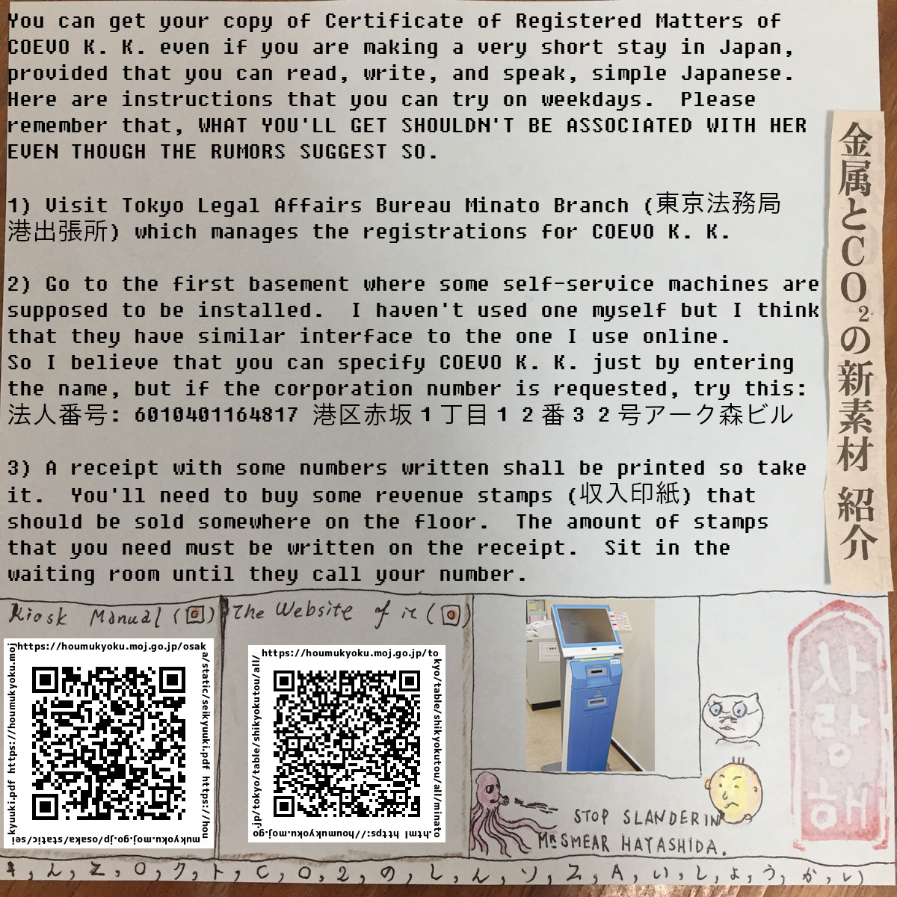

### March 11, 2024 
- 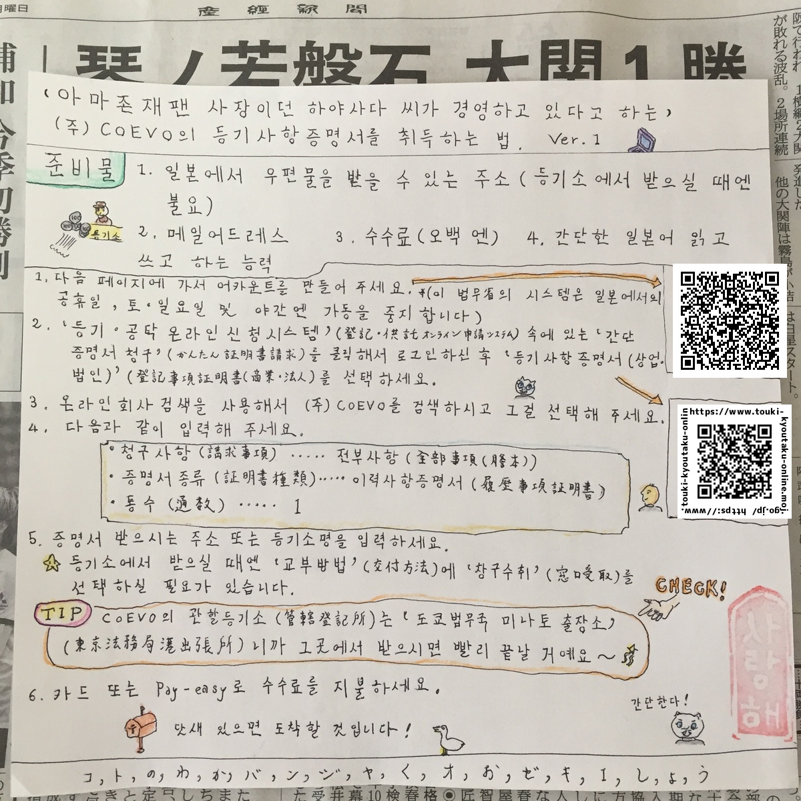

### March 7, 2024 
- 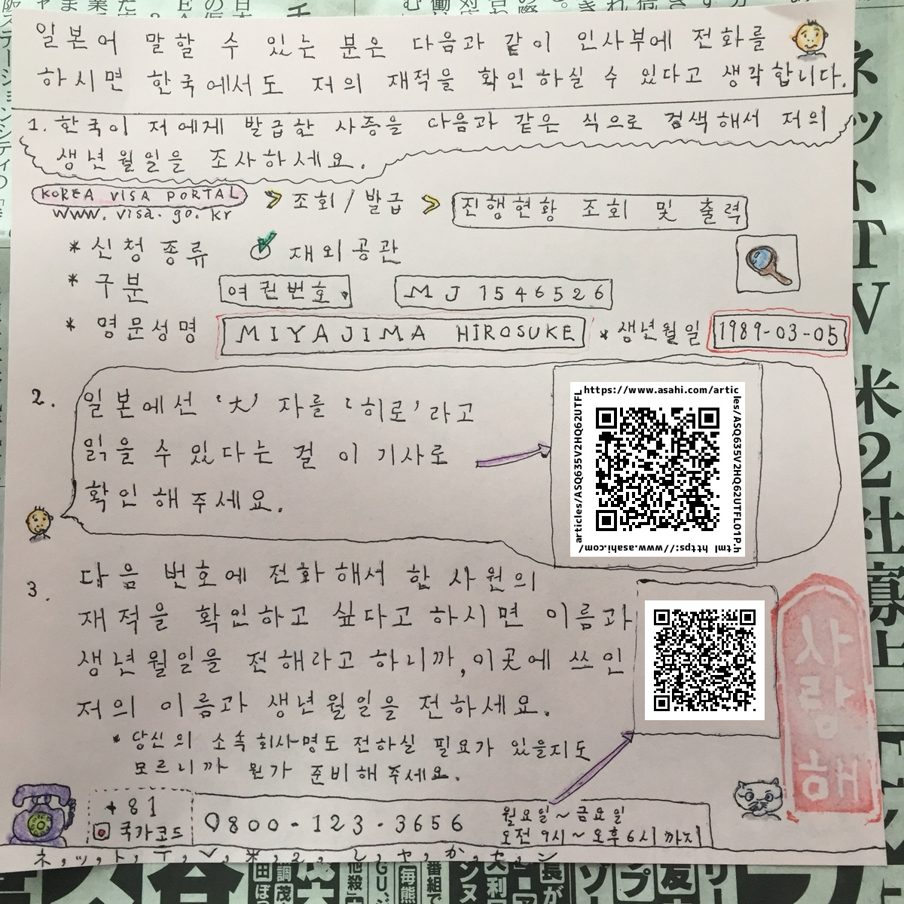

### March 3, 2024 
- 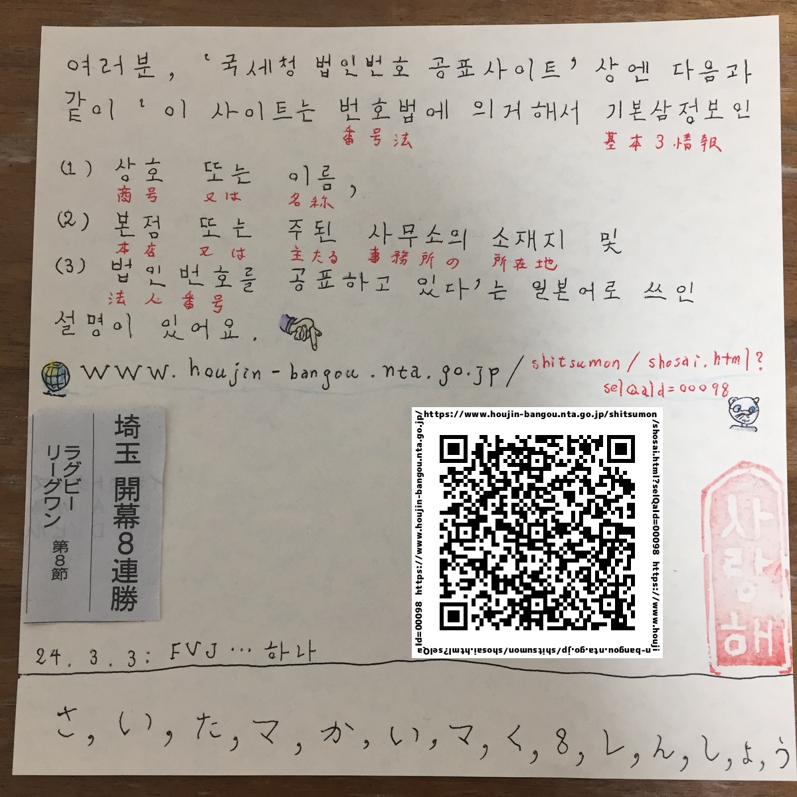
- It is written on FAQ section of *NTA's Houjin-bangou Ko-hyo Site* that "it tells only three essential information that are 1) the trade name or name, **2) the location of the head office or principal office,** and 3) the corporation number of a *Corporation Number Holder*" in Japanese: 

> *国税庁法人番号公表サイト（以下「公表サイト」といいます。）では、番号法に基づき、法人番号の指定を受けた者の基本３情報（１　商号又は名称、２　本店又は主たる事務所の所在地、３　法人番号）を公表しております。* 
> https://www.houjin-bangou.nta.go.jp/shitsumon/shosai.html?selQaId=00098

### March 1, 2024 
- 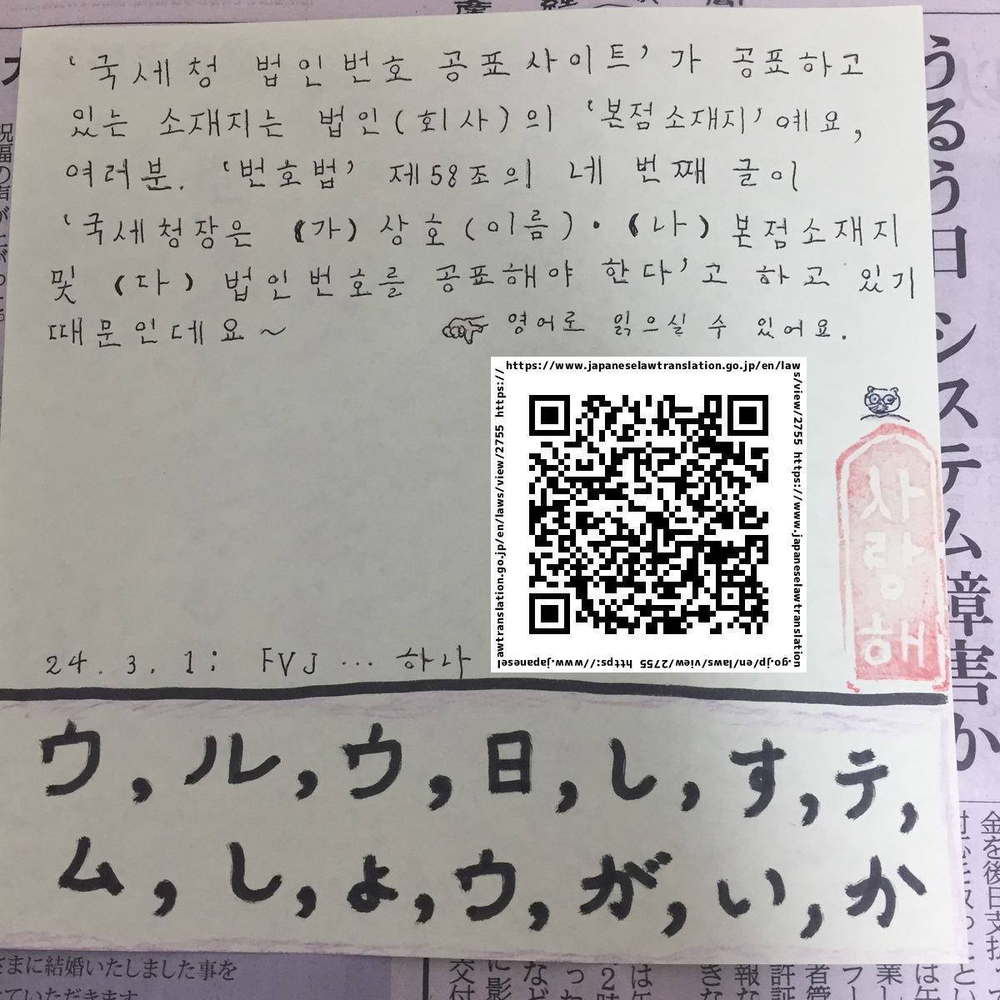
- Of course, NTA's *Houjin-bangou Ko-hyo Site* tells you the accurate address of HQ of an organization, as declared in the article 58 of *Act on the Use of Numbers to Identify a Specific Individual in Administrative Procedures (行政手続における特定の個人を識別するための番号の利用等に関する法律):* 

> *The Commissioner of the National Tax Agency must, pursuant to the provisions of Cabinet Orders, make public the trade name or name, the location of the head office or principal office, and the Corporation Number of a person that has been designated a Corporation Number (hereinafter referred to as a "Corporation Number Holder") pursuant to the provisions of paragraphs (1) and (2); provided, however, that with regard to Unincorporated Associations, etc., the Commissioner of the National Tax Agency must in advance obtain the consent of its representative or administrator.* 
> https://www.japaneselawtranslation.go.jp/en/laws/view/2755

### February 28, 2024 
- **PS:** このことは「国税庁法人番号公表サイト」の「よくある質問」にも書かれています。
  - Q. 法人の電話番号、代表者の氏名・住所を知りたいのですが、調べることはできますか。
  - A. 国税庁法人番号公表サイト（以下「公表サイト」といいます。）では、番号法に基づき、法人番号の指定を受けた者の基本３情報（１　商号又は名称、２　本店又は主たる事務所の所在地、３　法人番号）を公表しております。したがって、公表サイトでは、基本３情報以外の情報である法人の電話番号、代表者の氏名・住所を調べることはできません。
  - https://www.houjin-bangou.nta.go.jp/shitsumon/shosai.html?selQaId=00098
- 皆様は「国税庁法人番号公表サイト」に出てくる住所が法人の本店等の所在地ではなく、何か別のものだとお考えになったかも知れません。ただこのサイトが開設される上で根拠となったと考えられる法律がありそれは一般に「番号法」と呼ばれているものです。(正確には「行政手続における特定の個人を識別するための番号の利用等に関する法律」)これの第三十九条第四項には「国税庁長官は、政令で定めるところにより、第一項又は第二項の規定により法人番号の指定を受けた者（以下「法人番号保有者」という。）の商号又は名称、本店又は主たる事務所の所在地及び法人番号を公表するものとする。ただし、人格のない社団等については、あらかじめ、その代表者又は管理人の同意を得なければならない」とありますから、「国税庁法人番号公表サイト」が公表している住所が「本店又は主たる事務所の所在地」であることが前提知識なしでも理解出来るのです。もしまだ疑われているなら皆様がお勤めになっている会社等をこのサイトで検索してみて下さい。

### February 27, 2024 
- 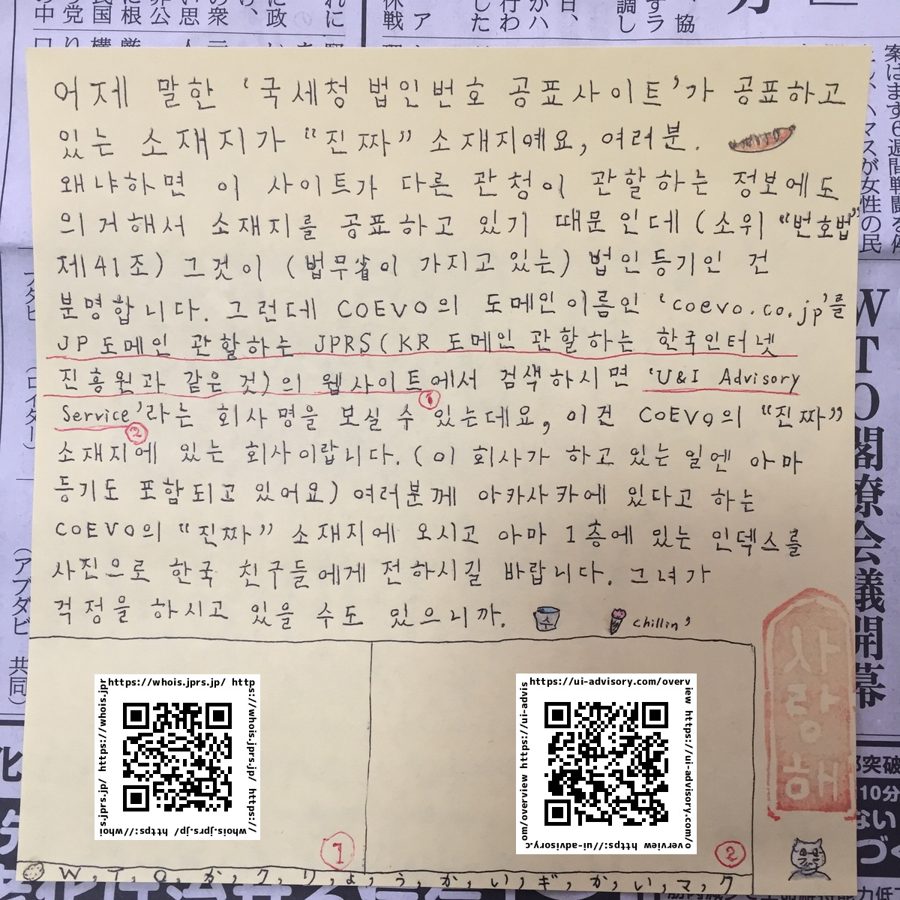

#### Ordinary companies vs. COEVO K. K. 

##### 1. WHOIS the domain name registrants for these companies? 
- [JPRS (Japan Registry Services)](https://en.wikipedia.org/wiki/Japan_Registry_Services) manages the .jp [TLD (top-level domain),](https://en.wikipedia.org/wiki/Top-level_domain) which COEVO uses for its domain name.  It also provides a service with which you can look up their [WHOIS](https://en.wikipedia.org/wiki/WHOIS) database online.  So let us see what it says for ordinary companies in Japan and our COEVO K. K.:
  - https://whois.jprs.jp/

###### 1-1. Jinro Inc. 
- 
  - The name of organization is registered correctly as *JINRO INC.*  Fuiyoh!  I love it Jinro!  

###### 1-2. LY Corporation (LINEヤフー株式会社) 
- 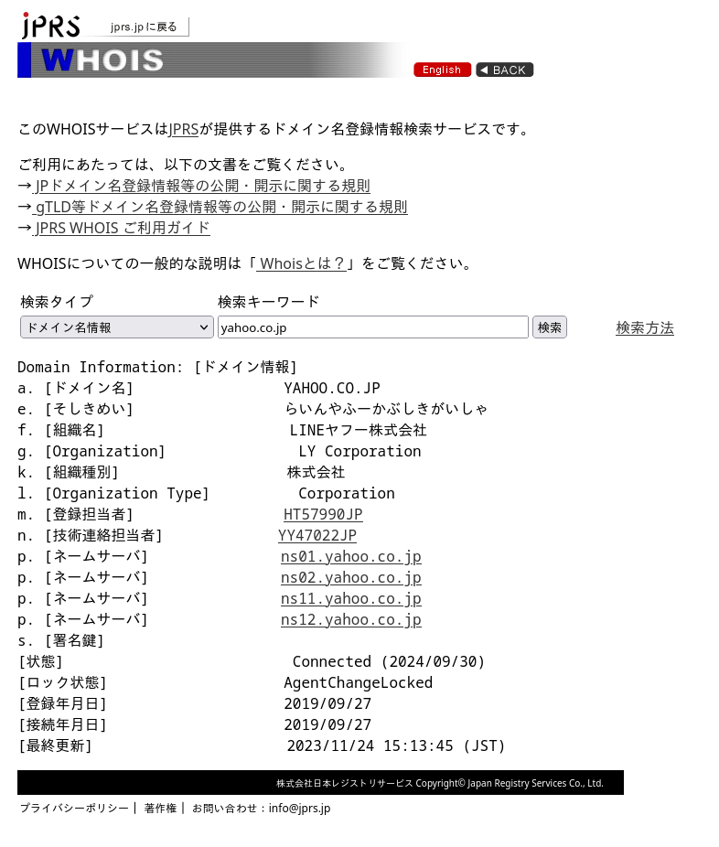
  - Correct!  

###### 1-3. COEVO K. K. 
- 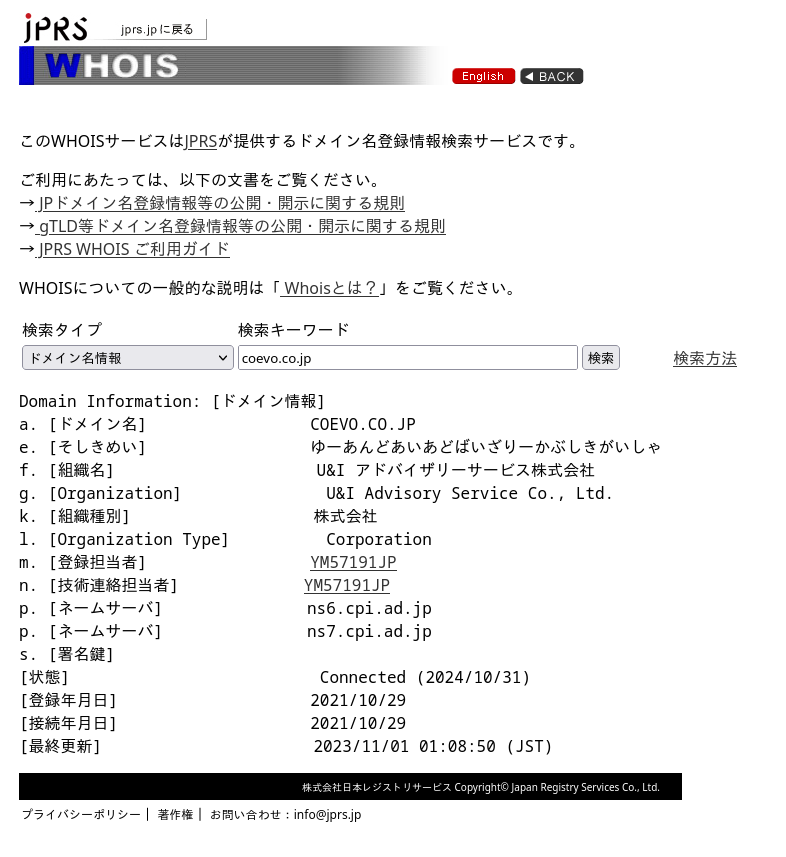
  - Hey, what the hell is this *U&I Advisory Service Co., Ltd.* which is registered in the record for COEVO K. K.?  Haiyaa...  

##### 2. Where are the HQ of these companies? 
- In Japan, every company has a duty to register information about itself, including its headquarters address, etc., and some of the information can be viewed via [NTA's](https://en.wikipedia.org/wiki/National_Tax_Agency) *Houjin-bangou Ko-hyo Site.*  So let us see what it says about ordinary companies in Japan and our COEVO K. K.:
  - https://www.houjin-bangou.nta.go.jp/

###### 2-1. CJ Foods Japan 
- https://www.houjin-bangou.nta.go.jp/henkorireki-johoto.html?selHouzinNo=5010401146849
- 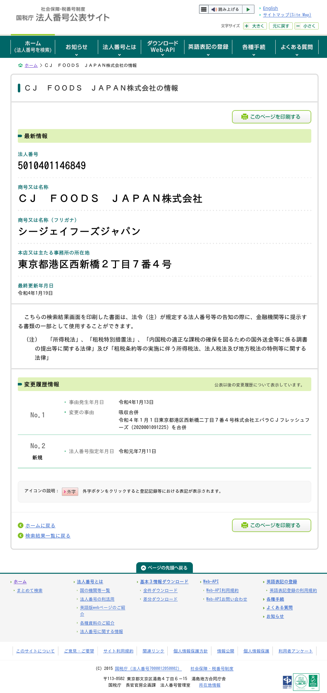
  - It has registered the address correctly as *東京都港区西新橋２丁目７番４号.*  Fuiyoh!  I buy your products!

###### 2-2. COEVO K. K. 
- https://www.houjin-bangou.nta.go.jp/henkorireki-johoto.html?selHouzinNo=6010401164817
- 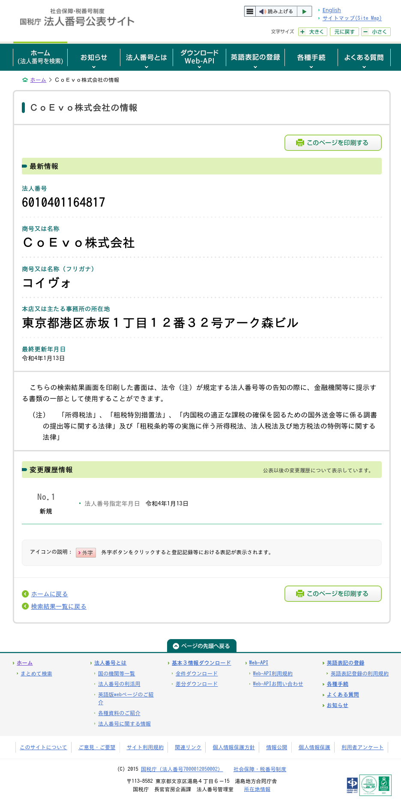
  - No!  It (*東京都港区赤坂１丁目１２番３２号アーク森ビル*) isn't its address of the HQ it states on [its website!](https://www.coevo.co.jp/)  Haiyaa...  You should have registered *東京都港区愛宕1丁目1-1* as you state on https://www.coevo.co.jp/ instead of this...  And this is...
- 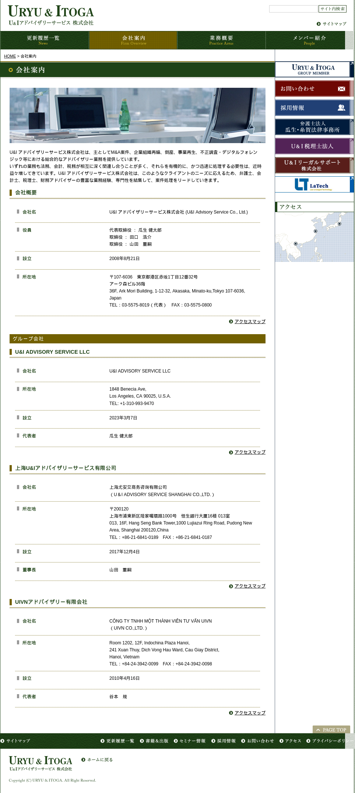
  - This is the address of *U&I Advisory Service Co., Ltd.* which I mentioned above!  Haiyaa... :disappointed: 

### February 26, 2024 
- 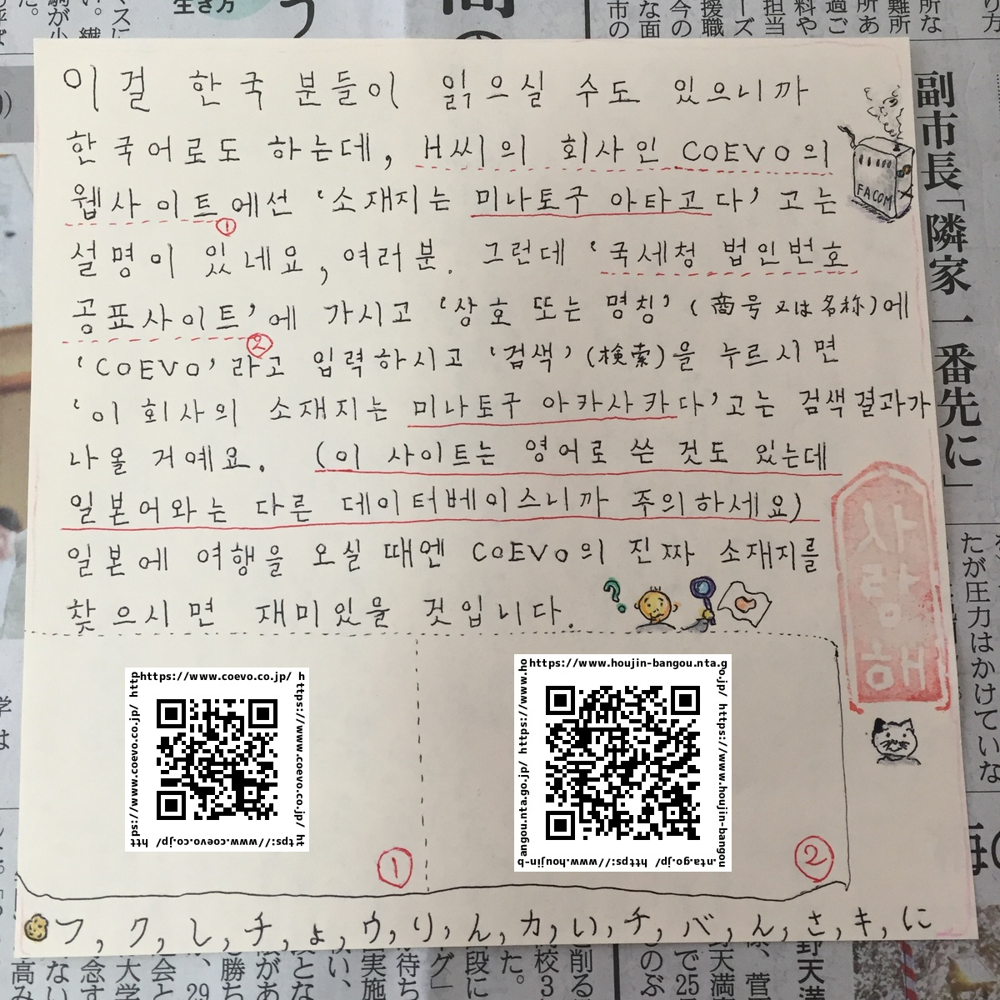
- **ANYONE can play this game!** 下記は「登記・供託オンライン申請システム」のアカウント作成画面をコピーしたものです。 ご覧になれば分かる通り本システムにアカウントを作成して登記事項証明書の郵送依頼を行うことは誰でも簡単に出来ることなのですね。 またこれは想像ですが、CoEvo株式会社の管轄登記所(東京)へ行けば当日中に登記事項証明書が発行されるかと思います。大阪法務局等の窓口で申請した場合の所要時間についてはよく分かりません。
  - 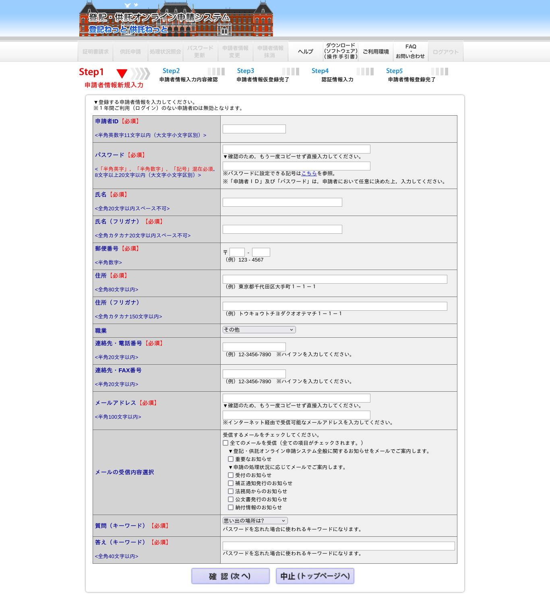

### February 20, 2024 
- 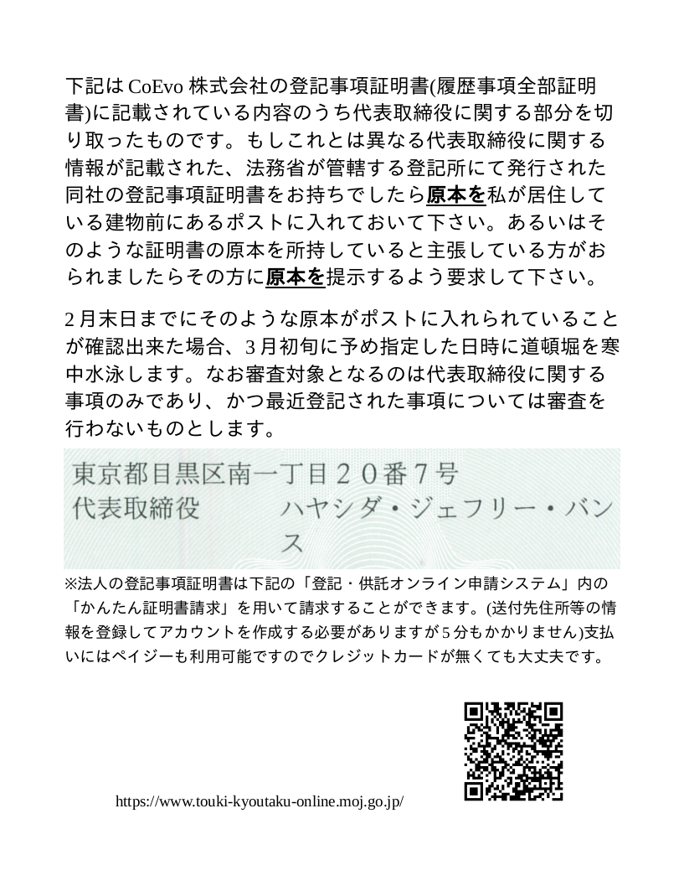
  - **登記事項証明書は請求から送付までに大体一週間(速達指定しない場合)かかるのでお早めに請求下さい。仮に上のと異なるものが2月末までに提示された場合道頓堀を泳ぎます。** 

### February 17, 2024 
- 以前も書いたことですが私は彼女と会うことが出来た場合預金通帳等のそれによって雇用を証明することが出来る物品をお渡しするつもりですし、彼女が用意したPC上で給与明細照会サイト等にアクセスしてお見せすることも想定しています。••マットトレーニングのことは同僚のアルバイト達も気付いているようですが、仮にあの方の思う通りになったとしてもまだ勝ち目がない訳ではないという事です。それから私は••マットトレーニング関連の動画ファイル等を自分のGitHubアカウントのプライベートリポジトリに保管しているのですが、そのことも含めてお伝えしておきます。

### February 16, 2024 
- あのセンターに勤めていてA合同会社なりC株式会社の登記事項証明書を取得された方がおられましたら、それをセンター内での連絡に用いられているSNS(もしあれば)で共有して頂ければと思います。多分あの方はご自身で登記事項をご覧になろうとはされないと思います。私は本社の方々がこれをどのように(心理的に)処理したのかが気になっています。ソールラルに作成したビデオレターに出てくるエンジニア職に関するメールは私がHさんの会社の登記事項について騒ぎ出した直後に受信したものですので、少なくとも本社はあのセンターよりも行動が早かったのだと思われますが。
- PS: A合同会社ないしC株式会社の登記事項証明書にはHさんのご住所が記載されていますが果たしてそこにHさんのお住まいは存在するのでしょうか。私が無期雇用に転換されるまで雇用され続けている現在彼らがこれまで行ってきたことに何の意味があったのだろうと思います。彼らがやったことは時間と手間をかけて自分達の墓を作るような、とんでもなく馬鹿馬鹿しい行いだったのではないかと感じなくもありません。

### February 12, 2024 
- 私が昨年初めてこれらの会社の登記事項について述べた直後あのセンターの責任者である方が私が食事をしている側まで来られて私が文学部出身だとか何とか大声で話されているのを聞いたのですが、これがフィクションであるか否かは誰でも調べることが出来ることなのです。オンラインで登記事項証明書を請求するにはメールアドレスと送付先の住所があれば良いので未成年でも、あるいは日本に滞在している外国人であってもこれを確かめることが出来ると思います。(請求から送付まで一定の日数を要するのでそれは考慮する必要がありますが) 

### February 11, 2024 
- もしかすると皆さんは登記事項証明書を取得するには法務局まで行かないといけないとお思いになり躊躇されているのかも知れませんが、インターネット上で証明書の送付を申請するサービスが法務省によって用意されています。グーグルで「登記ねっと」と検索すると「登記・供託オンライン申請システムというサイトが出てきますのでこれのメニュー内にある「かんたん証明書請求」を押して下さい。(本サイトの稼働時間は平日の日中に限定されています)不動産のと法人のとがありますが法人でOKです。申請時に住所等を登録してアカウントを作成する必要がありますが5分もかからないと思います。手数料の支払いにはインターネットバンキングないしペイジーが利用可能です。後者ですと郵便局のATMで現金ないしキャッシュカードで支払いが可能です。

### February 9, 2024 
- 登記事項証明書までご覧になった方は納得されることでしょうが、Hさんの会社に関するデータはまともな部分が無いといっても過言ではないほどおかしいのでこれについて公の場で話したり、あるいはYouTube等の素材にすることも別に構わないと思います。それにこれは恐らくある種の方々の間では既に有名になっているものなのです。

### February 8, 2024 
- 先日よりあるポスターをホームページ上に掲載しておりますが、依然一件の連絡もありません。法務局は土日は休みですので行くなら早めにお願いします。(法務局は不動産会社の社員など普通の方々も出入りする、何ら怖くない市役所や税務署のような場所です) 

### February 7, 2024 
- 同僚の皆さんの誰かがやっと(A合同会社ないしC株式会社の)登記事項証明書を申請した可能性はあると思いますが、そうだとするとC株式会社のを申請する際に奇妙に思われたことでしょう。というのは法務局のウェブサイト(登記・供託オンライン申請システム)上に表示されるC株式会社の本店所在地がC株式会社のホームページに記載されているものと異なるからです。
  - :bulb: ヒント: 「国税庁法人番号公表サイト」でC株式会社の本店所在地を調べてみて下さい。(どうしてホームページに書いてある本店所在地と異なるのでしょう :suspect:) 
    - https://www.houjin-bangou.nta.go.jp/
- これについて詳しく調べたければグーグルで「JPRS WHOIS」と検索してみて下さい。そこに出てくるウェブサイトの検索欄にC株式会社のドメイン名(coevo.co.jp)を入力してボタンを押すと、何やら見慣れない会社名が表示されますね。次にその会社の住所をグーグルを使って調べてみてください。
  - :bulb: ヒント: グーグルを使って「アーク森ビル」のテナント一覧を調べてみて下さい。あるいは東京にお住まいなら直接ビルのエントランスまで出向いてみて下さい。
- 皆さんはこんなことを書くと彼女が怒るんじゃないかと思われるかも知れませんが私はそんなことはないと思っています。むしろ彼女も私と同様皆さんが鈍感で行動が遅いことに対してイラついているかも知れないとすら思います。それに、うまく行けばこれで彼女がヤクザのお嬢だという噂を払拭出来るかも知れません。最近様々な嫌がらせを受けて感じるのは皆さんにとってヤクザというのは「手足をもがれた害虫」みたいなものでこれ以上面白おかしいものは無いようなんですね。恐らく私が解雇されたという噂を流すよう指示した方もそういった考えの持ち主だったのだと思います。 
- PS: C株式会社のホームページに記載されている本店所在地には下記のようなビルが建っているらしいのですが、私が調べてみた限りこれは集合住宅であって、オフィスビルではないです。誰が現地に行って調べてみて下さい。
  - 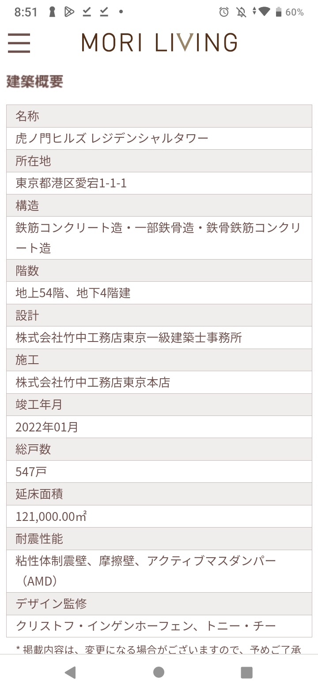

### February 6, 2024 
- 私が初めて彼女にお会いしたのは○○ゾンに入社した2019年2月13日でしたので、彼女がこの私の入社日を覚えておられることを期待しています。というのはこの5年後である2024年2月13日がまもなく到来し、かつこの私の5年勤続が達成される日というのがある程度重要なものになると思われるからです。(彼女は私の最初のマネージャーであり、初めて会話をしたのもこの日だったと記憶しています)
- 以前にも書いたように改正後の労働契約法には「通算の勤続年数が5年に達した有期雇用労働者は雇用主に無期雇用への転換を申請する権利を獲得する」という内容の条文が含まれています。○○ゾンでは主に人事部の負担を軽減する目的で契約社員の契約更新の時期を(少なくとも私と同時期に入社した一団については、4月・10月の)年2回に統一していますので、ほどんどの契約社員の勤続5年到達日が雇用契約更新日と重ならないのですが私の場合もそれに該当します。これも同様に人事部の負担軽減の為だと思われますが無期雇用への転換についても勤続5年到達日ではなく勤続5年が達成される日を含む雇用契約期間分の雇用契約書が発行されるタイミングで行う処置がとられています。その為私は既に無期雇用に転換されているのですが、このような○○ゾン内での特殊なケースを考慮せずとも2024年2月13日には通算契約期間が5年となりますので部外者の方々も私が無期転換申込権を獲得していると認識されるだろうと思われます。(下記の資料に記載されているケースはいずれも入社日から起算して一定年数が経過した日に雇用契約更新がなされているので○○ゾンの場合とやや異なります)
- なお私が無期雇用へ転換される以前に雇用主と締結していた契約に係る雇用契約書には「会社は本契約を更新する場合がある。但し契約が更新される場合であっても、採用日(但し2013年3月31日以前に採用された場合は2013年4月1日)から通算して5年が到達する日の属する月の前月末日までを雇用期間の限度とするが、当該5年到達日が月の末日の場合は当該日までを雇用期間の限度とする」の一文がありましたので、私が既にこの制約から外れていることは皆様も納得なさるかと思います。
- 参考: 
  - https://www.mhlw.go.jp/file/05-Shingikai-12602000-Seisakutoukatsukan-Sanjikanshitsu_Roudouseisakutantou/0000033690.pdf

### February 4, 2024 
- *追記:* 皆さんは私が何を言っているのか分からなかったかも知れませんがA合同会社の登記事項証明書に記載されているHさんの住所をGoogleストリートビューで検索すると他の方の表札が掲げられた住宅の写真が出てくるのですが、Googleストリートビューには最新の写真だけでなく過去の写真を表示する機能もあるのでそれを試してみてもやはり全て同様の結果となるのです。 :suspect: 
- もしかすると同僚の皆さんは私が最近アップロードしたA合同会社の登記事項証明書が真正のものとは信じられないのかも知れません。(C株式会社の分については誰かが既に確認した可能性はあると思います)これに対しては皆さんも登記事項証明書を取得してみて下さいとしか言いようがありません。(1通500円しますが仲間内で100円ずつ出し合って皆で回覧するとかすれば大した負担にはならないと思います。法務局に行って取得すれば少し安いかも知れませんし、即日で発行されるはずです)
- この登記事項証明書について私の推測を述べるとまずGAFAのような巨大なIT企業はどこかでお互いに繋がっているんじゃないかということです。それから、私達の雇用主にとってもHさんのことは抹消したい事項であり他社が管理する地図サイト等のデータも可能であれば書き換えたいだろうということです。以前触れたようにLinkedInを管理しているのはマイクロソフトですが、こういったプラットフォーマーが例えば特定のアカウントの職歴欄を非表示にしたり、「いいね」一覧のソート規則を変更して3年前の項目がトップに表示されるようにするということはある程度までは可能かも知れません。

### February 1, 2024 
- 過去に取得したアマゾンジャパン合同会社の登記事項証明書(履歴事項全部証明書)は破棄してしまったのですが最近再取得しましたのでHさんの在任時の住所が記載されているページだけここに貼り付けておきますね。(下線がある部分は抹消事項です)ついでにCoEvo株式会社の分も載せておきます。
  - 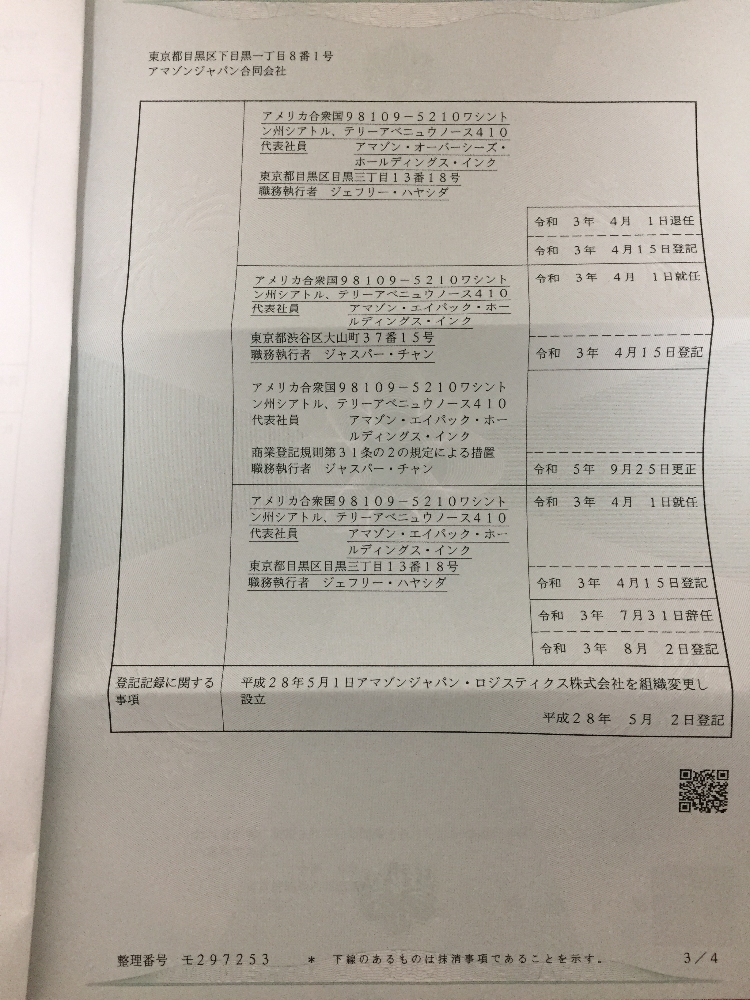
  - 

### January 30, 2024 
- 以前から数え切れないほど書いているようにWAON利用履歴を照会する為のウェブサイト(WAONネットステーション)には前提知識がない人々を混乱させかねない独特の仕様があります。私はそれを「ウサギとカメ」と呼んでいましたが、より分かりやすくする為に下記の資料を作成しました。(本当は動画を作成した方が多くの方に理解してもらえると思うのですが、残念ながらその為の時間がありません) 
  - 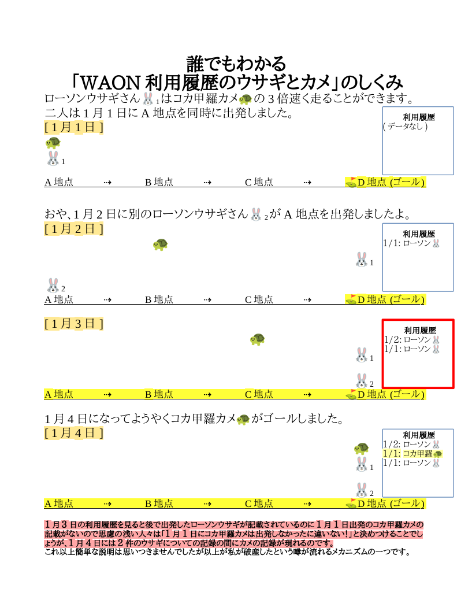

### January 27, 2024 
- 私があのポスターを作成したのは一つには人々をからかいたかったからですが、もう一つの理由はバンスさんのお住まいの近くにあるものと思われる本社の方々にも事実を知って頂きたかったからです。CoEvo株式会社の代表取締役として登記されているバンスさんの住所はアマゾンジャパン合同会社の抹消事項として記載されているHさんの在任時の住所とは異なります。(どちらも目黒区内ですが)もしお知りになりたければアマゾンジャパン合同会社の履歴事項全部証明書をご覧になって下さい。

### January 22, 2024 
- WAON利用履歴照会サイト(WAONネットステーション)上で一定の条件下で「欠番」が発生しうるということについて、もしかするとWAONコールセンターに電話して質問すれば確かめられるかも知れません。今回のようなケースは非常に稀らしいので、かなりしつこく聞かないと聞き出せないかも知れませんが「何らかの原因で端末とWAONセンターとの間の通信が途絶えたりした場合、伝票データがWAONセンターに届かないことにより欠番が生じうるのか、またその際に決済の方は正常に完了するのはどうしてなのか」等とお聞きになってみてはと思います。下記はWAONコールセンターの電話番号(フリーダイアルは携帯電話だと繋がらなかったです)と私が過去にWAONコールセンターと行ったやりとりの記録です。 
  - https://www.waon.net/contact/
  - フリーダイアル: 0120-577-365
  - 携帯電話向け: 0570-064-375
  - https://raw.githubusercontent.com/anissatta/fragments/main/waon.mp3

### January 21, 2024 
1. 昨日言及した社内Wikiの更新履歴ですが、下記URLを社内PCで開くと「Profile of hirosuk」というページが表示されると思います。このページの下部にある「History」という欄に「Jul 24, 2020 09:34 PM UTC Created user」とありますので多分この日に社内Wikiの利用を開始したのではないかと思いますがもう少し調べてみます。
  - https://w.amazon.com/bin/view/XWiki/hirosuk#History
2. 下記URLにあるAssociate2TechのWikiにはJan 23, 2021 08:11 AM UTCに「Hi. Will this program be available in the countries outside U.S. (ex. Japan) when restarted?」とコメントを書きましたがこれが多分最古のコメントです。ここでUTCというのは日本時間とは異なるタイムゾーンであることに注意して下さい。この時期に彼女はこのセンターに在籍されていたと記憶します。あとインターネット上にこれについての情報があるか分かりませんが、アマゾンの契約社員というのは退職後すぐに再応募出来るのではなく一定の応募禁止期間が設定されているのです。「5ちゃんねる」内にあるあのセンターに関する掲示板にもそれが書かれているかも知れません。
  - https://w.amazon.com/bin/view/Associate2Tech/#Comments

### January 20, 2024 
- 先日社内異動制度について書いた事によりまた新たな噂が生じた可能性があるので補足しますが[katkit](https://github.com/anissatta/katkit)にあるOutlookを用いた在籍確認を実行すると私の職名が「Junior Associate (NFTC)」であることが分かります。NFTCというのは無期雇用転換済の契約社員は契約書をもう一度よくご覧になって欲しいのですが、無期雇用転換済の契約社員に付与される記号らしいです。無期雇用転換は勤続5年が見込まれる雇用期間の直前になされますね。これについてはまた書きます。 

**※下記はkatkitの該当の箇所からの引用です。各拠点に設置されているであろう共有PCや正社員の方であれば普段業務に使うラップトップを起動して以下の操作を行ってみて下さい。**

1. Outlookのアプリを起動するか、ブラウザのアドレスバーに https://ballard.amazon.com/owa/ と入力してOutlookのWeb版を起動する。(「owa」は「Outlook Web Access」の略です) 
2. アプリの場合上部にある「ユーザーの検索」、Web版の場合左上にある「メールとユーザーの検索」とかいう欄に「Hirosuke Miyajima」と入力する。 
3. Web版の場合、検索結果の右側にある名刺のようなアイコンをクリックすれば私の勤務地や職名(Junior Associate)、上司の氏名といった情報が確認出来ます。アプリの場合も同様だったと思います。 

- 私の雇用の継続性について調べる他の方法として私がある時期から毎出勤日に更新している社内Wikiの更新履歴を調べることが考えられます。詳しくは明日現物を調べてから書きますが、コンピュータが得意な方は社内PCで下記のアドレスを開いてから確か下部にある私の顔写真をクリックしてみて下さい。 
  - https://w.amazon.com/bin/view/Users/hirosuk
- 私が社内ネットワーク上に初めて残した痕跡はAssociate2TechのWikiへのコメントです。Amazon Wiki(w.amazon.com)で「Associate2Tech」と検索すると出てくるページの中程に私の最古のコメントがご覧になれると思います。(私はここにコメントを複数書いていますが、上の方にあるのが古いやつです) 

---- 

- Amazonの社員の皆さん、news.a2z.comにアクセスして私の書いたコメントを探してみて下さい (私は土・日曜日に出勤する際には可能な限りコメントを書くようにしています。平日は大抵新しい記事が投稿されるのでそれらに「いいね(Like)」することでその代わりとしています) 
- アソシエイト(アルバイト)の皆さん: 現在共有PCを用いてInside Amazon(inside.amazon.com)にアクセスすることは不可能になっていますが、A to Z Newsのアドレスを直接入力すれば社内ニュースを閲覧出来ます。今後も社内ニュースにLikeしたりコメントを書いたりしていきますので以下をご確認頂くようお願いします。**(言うまでもありませんが、下記のURLにアクセスするには共有PC等のAmazonネットワークに接続されたパソコンを使用する必要があります)** 
  - https://news.a2z.com
  - 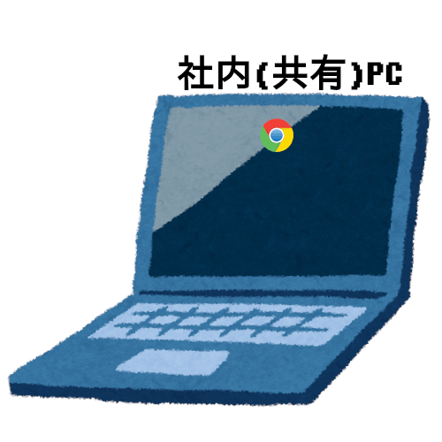

---- 

- 下記は私が日々のスーパーでの買い物時に使用しているプリペイドカードの番号と、利用履歴を照会する為のサイトのURLです。
  - :shopping_cart: KONOMIYA 
    - ID: 8804-9010-0696-8023
    - PIN: 735157
    - https://www.vcsys.com/s/konomiya/m/
  - :shopping_cart: TOP WORLD 
    - ID: 8886550092228199
    - PIN: 157544
    - https://nir001.ppsys.jp/ZZ11FSUZHS/Login/cardLogin

- :smile_cat: 韓国や(トップワールド・コノミヤが店舗を展開していない)関西以外の地域にお住まいの方々が私がこれらのスーパーマーケットでの買い物時に使用しているプリペイドカード、とくにその利用履歴照会サイトについて疑問を抱くのは当然だと思います。(URLが少し変ですし、私がいつも切りの良い金額を支払っているからです)ただまずトップワールドについて述べるとこれのプリペイドカードの残高照会サイトのURLはトップワールドの公式ホームページに記載されているのですね。下記のページをスクロールしていくと「電子マネーMottokuカード残高照会ページ」というリンクがあるのでそれをクリックするとそれが表示されます。
  - https://topworld.jp/
- またトップワールドに設置されているプリペイドカードチャージ機の形状がコノミヤにあるものと瓜二つであることや、残高照会サイトのデザインまで似通っていることに気付かれた方もおられたかも知れません。これは何故かというとこれらのスーパーマーケットは自社でこういったシステムを開発している訳ではなく、どうもどちらも同じ(バリューデザイン社というシステム会社の)パッケージを流用しただけのようでありその為だと思われます。下記のバリューデザイン社の導入実績ページにもトップワールドが紹介されていますね。
  - https://cs.valuedesign.jp/case/list/topworld
- コノミヤはこの導入実績ページに掲載されていませんが、下記の「ニュース」には「2016.08.02 コノミヤプリペイドカードを導入事例に追加いたしました」とあります。
  - https://www.valuedesign.jp/news/page/26/
- コノミヤプリペイドカードの残高照会サイトのドメイン名である「vcsys.com」をGoogleで検索すると他のスーパーマーケット等の残高照会サイトが表示されますから、恐らくこれはバリューデザインが所有するドメインの一つであり、その一部をコノミヤが使っているのだと思います。謂わば一つのアパートの各室にスーパー各社が居住しているようなものです。コノミヤの同居人の一つであるスーパーハートのホームページを以下に示しますが、ここで使われている「モ〜ちゃんカード」の残高照会サイトのURLが「 https://www.vcsys.com/s/nakayama-farm/p/ 」であることがお分かりになることでしょう。(下部にある「残高照会へ」をクリックしてみて下さい)
  - https://heart.nakayama-farm.jp/card/
- 最後に私がよく切りの良い金額や面白おかしい金額を支払っている理由について説明致しますと、あれは私が世間で思われているような数字恐怖症(numerophobia)患者ではないということを皆様に示すためにやっていることなのです。(時間が無いときはかなり適当に買い物していますが)numerophobiaという言葉は算数恐怖症という意味もあるようなのですが、私は算数は結構得意です。 
